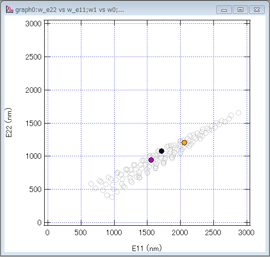

GUI PLEmap Viewer
====

Thsi is GUI based CNT PLEmap Viewer.

##Install
1. save `GUI-PLEmapView.pxp` and `Procedure.ipf` as same folder

2. open the pxp file

##How to Use ?
1. Chose _n_ and _m_ of C(n, m) you want to know. You can select 3 sets.

2. Push the DISPLAY button, and then the circles are displayed.

###attention
- if worng combination, display button is disable.

##Link
 - [Single-Wall Carbon Nanotube (SWCNT) Assignment Table:](http://www.ece.rice.edu/~irlabs/research.htm)
